# MesoNet — Deepfake Detection (reproduction)


[](https://noahshahraz.github.io/mesonet-deepfake-detection/dashboard.html)

<picture>
  <source media="(prefers-color-scheme: dark)" srcset="assets/hero_banner.svg">
  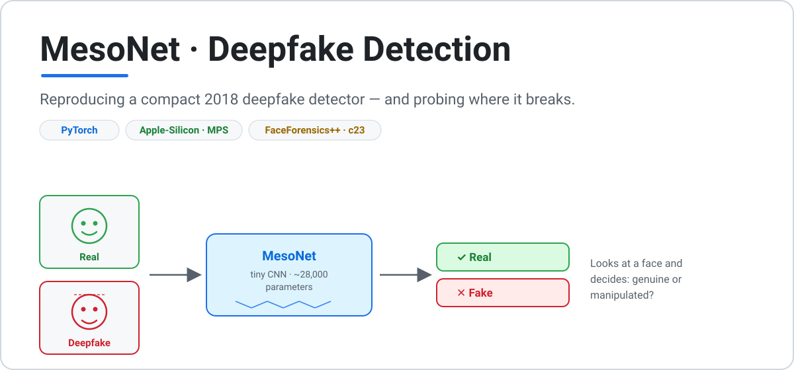
</picture>

A from-scratch PyTorch reproduction of **MesoNet** (Afchar, Nozick, Yamagishi & Echizen,
*MesoNet: a Compact Facial Video Forgery Detection Network*, WIFS 2018,
[arXiv:1809.00888](https://arxiv.org/abs/1809.00888)). Two deliberately tiny CNNs — **Meso-4** and
**MesoInception-4** (~28k parameters each) — classify a face image as **real** or **forged**.

Trained locally on an Apple Silicon MacBook Pro (M-series, 24 GB) using the PyTorch **MPS** backend.

## What this project does
1. **Reproduces** the paper's headline numbers on **FaceForensics++** (~98% accuracy on Deepfakes,
   ~95% on Face2Face).
2. **Tests generalization** — takes the FaceForensics++-trained model and evaluates it, unchanged,
   on other deepfake datasets to measure how far performance transfers.

## Method in brief
Both networks work at a *mesoscopic* scale — between raw pixel noise (destroyed by video
compression) and high-level semantics — where forgery artifacts survive.

- **Meso-4:** four `Conv → ReLU → BatchNorm → MaxPool` blocks (8, 8, 16, 16 filters; the last pool
  is 4×4), then `Dropout → Dense(16) → LeakyReLU → Dropout → Dense(1)`.
- **MesoInception-4:** the first two conv blocks are replaced by Inception-style modules with
  parallel branches using **dilated** 3×3 convolutions (rates 1–3), concatenated; the rest matches
  Meso-4.

See [`src/models/`](src/models). Both nets pass `pytest -q` and come in under 50k parameters.

<picture>
  <source media="(prefers-color-scheme: dark)" srcset="assets/architecture.dark.svg">
  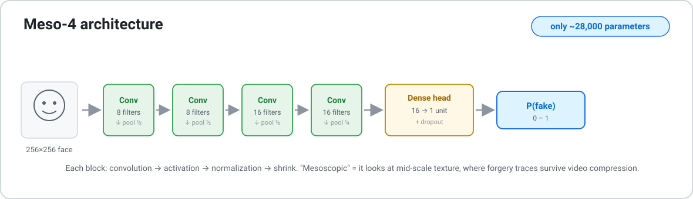
</picture>

## Setup
```bash
python -m venv .venv && source .venv/bin/activate
pip install -r requirements.txt
pytest -q                     # model smoke tests should pass immediately
```

## Data
Three datasets, all normalised to `data/<name>/<split>/{real,fake}/*.jpg`. See
[`scripts/download_data.md`](scripts/download_data.md). Start with **OpenForensics** (no access
form); request **FaceForensics++** access in parallel.

| Dataset | Role | Images | Fake type |
|---|---|---|---|
| OpenForensics (`manjilkarki`) | quick baseline | 190,335 | forged faces, in-the-wild |
| FaceForensics++ | **paper reproduction** | ~15–20k face crops | face-swap + reenactment |
| 140k Real/Fake (`xhlulu`) | generalization | 140,002 | StyleGAN synthetic |

<picture>
  <source media="(prefers-color-scheme: dark)" srcset="assets/pipeline.dark.svg">
  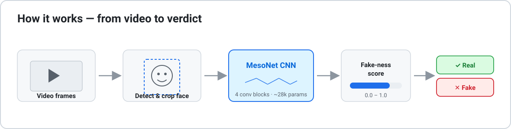
</picture>

## Reproduce (one line)
Arrange a dataset per [`scripts/download_data.md`](scripts/download_data.md) first; pass
`--data-root` if it lives outside the repo (e.g. `~/mesonet-data/openforensics` on this machine —
omit the flag if you used the default `data/openforensics`).

```bash
# train then evaluate Meso-4 end-to-end (full OpenForensics: ~2.5 h on an M-series MacBook, MPS)
python -m src.train --config configs/default.yaml --data-root ~/mesonet-data/openforensics && \
python -m src.eval  --config configs/default.yaml --data-root ~/mesonet-data/openforensics --checkpoint checkpoints/best.pth
```

Reviewer-friendly fast variant (~5 min, same code path, lower numbers). Run names default to
`<model>_<dataset>`, and re-running a name **refuses to overwrite** existing checkpoints/outputs —
pass `--overwrite` to replace them or `--run-name`/`--out-stem` for a fresh set.
(`checkpoints/best.pth` is a convenience copy that always tracks the most recent best run.)
```bash
python -m src.train --config configs/default.yaml --data-root ~/mesonet-data/openforensics --max-per-class-train 2000 --epochs 3 && \
python -m src.eval  --config configs/default.yaml --data-root ~/mesonet-data/openforensics --checkpoint checkpoints/best.pth
```

## Results

<picture>
  <source media="(prefers-color-scheme: dark)" srcset="assets/fig01_overview.dark.png">
  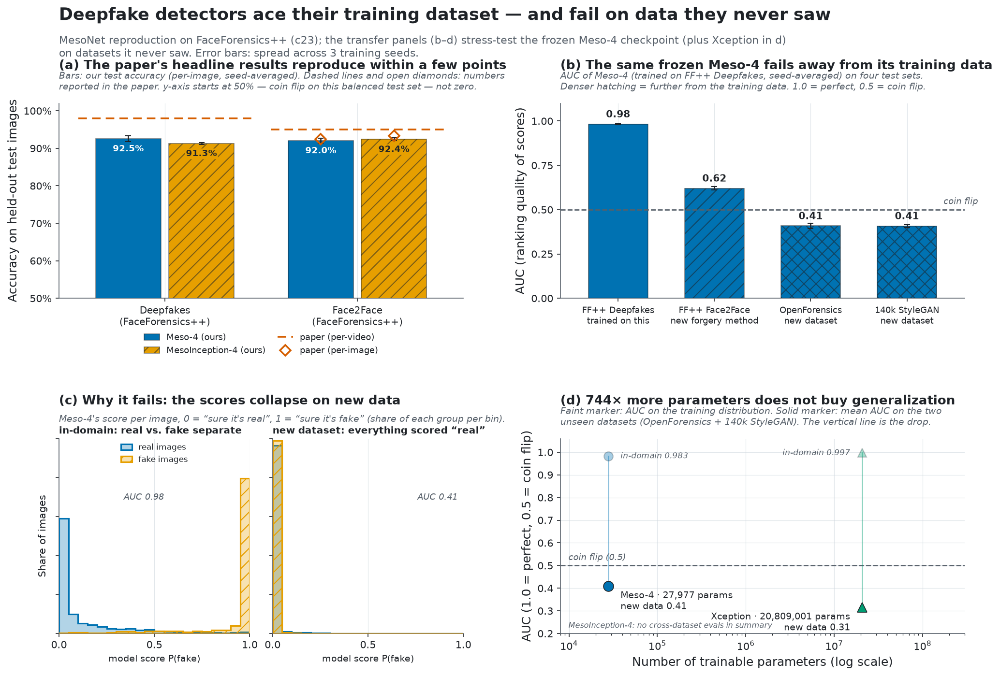
</picture>

_Every number in the figures traces to [`results/summary.json`](results/summary.json); regenerate
with `python scripts/make_figures.py`. Explore interactively at the
[**▶ live dashboard**](https://noahshahraz.github.io/mesonet-deepfake-detection/dashboard.html)._

<details>
<summary><b>Baseline — OpenForensics (NOT paper-comparable)</b> — full 190k-image Kaggle set, click to expand</summary>

Full 190k-image Kaggle set (`manjilkarki/deepfake-and-real-images`), full train split (140,002
images), best-val-AUC checkpoint, threshold 0.5. Both models reach val AUC ≈ 0.990; the test
split is markedly harder than val (val acc ~0.93 vs test ~0.87) — a known distribution quirk of
this dataset, reported as-is.

| Model | Test acc. | AUC | Precision | Recall | F1 |
|---|---|---|---|---|---|
| Meso-4 | 0.874 | 0.957 | 0.901 | 0.843 | 0.871 |
| MesoInception-4 | 0.871 | 0.952 | 0.882 | 0.860 | 0.871 |

</details>

### Reproduction — paper vs. this repo (FaceForensics++)
FaceForensics++, **c23 (HQ) compression**, per-image scoring on 20 frames/video, threshold 0.5
(untuned), official disjoint identity splits. The paper's ~98%/~95% come from the authors' own
lighter-compression dataset with per-video frame aggregation, so per-image c23 numbers landing a
few points lower is **expected, not a defect**.

All "Mine" cells are **mean ± std across three training seeds** (42, 1, 2).

| Model | Method | Paper acc.* | Mine acc. (c23) | Mine acc. (tuned t†) | Mine AUC |
|---|---|---|---|---|---|
| Meso-4 | Deepfakes | ~0.98 | 0.925 ± 0.008 | 0.930 ± 0.004 | 0.983 ± 0.002 |
| MesoInception-4 | Deepfakes | ~0.98 | 0.913 ± 0.002 | 0.930 ± 0.009 | 0.983 ± 0.004 |
| Meso-4 | Face2Face | ~0.95 | 0.920 ± 0.007 | 0.919 ± 0.007 | 0.972 ± 0.004 |
| MesoInception-4 | Face2Face | ~0.95 | 0.924 ± 0.004 | 0.923 ± 0.004 | 0.972 ± 0.002 |

*Consistency with the paper: the Deepfakes-easier-than-Face2Face ordering holds cleanly on AUC
(0.983 vs 0.972, non-overlapping across seeds); on raw accuracy it is within seed noise. The
multi-seed runs also settle an earlier question: at threshold 0.5, Meso-4 beats MesoInception-4
on Deepfakes on **every** seed (+0.4 to +2.4 pts) — but their AUCs are identical and their
val-tuned accuracies converge to the same 0.930, so the gap is **calibration, not ranking
quality**. For a like-for-like anchor, the paper's own *per-image* c23 Face2Face accuracies are
92.4%/93.4% — right in line with ours; the 95–98% headlines are per-video aggregates.

†Threshold selected per seed on the **validation** split (`scripts/tune_threshold.py`), never on
test (seed-42 values: 0.50 / 0.69 / 0.53 / 0.66). Tuning matters exactly where calibration was
off — MesoInception-4/Deepfakes — and is a no-op elsewhere. The residual gap to the paper's
headlines is therefore the per-image c23 protocol, not calibration (see per-video results below).

### Per-video scoring — the paper's actual protocol
The paper's 95–98% headlines average each network's prediction over the video before deciding.
Applying the same aggregation (mean P(fake) over the 20 sampled frames per video, threshold 0.5;
`scripts/eval_per_video.py`) to the identical checkpoints, on 280 test videos per method,
mean ± std across the three seeds:

| Model | Method | Per-image acc. | **Per-video acc.** | Per-video AUC |
|---|---|---|---|---|
| Meso-4 | Deepfakes | 0.925 | **0.955 ± 0.017** | 0.994 ± 0.002 |
| MesoInception-4 | Deepfakes | 0.913 | **0.950 ± 0.009** | 0.995 ± 0.003 |
| Meso-4 | Face2Face | 0.920 | **0.950 ± 0.011** | 0.984 ± 0.003 |
| MesoInception-4 | Face2Face | 0.924 | **0.951 ± 0.007** | 0.985 ± 0.001 |

Video-level aggregation adds ~3 points across the board, and **Face2Face lands on the paper's
number**: 0.950–0.951 vs the paper's 95.3% at the same compression — a match within noise, under
the paper's own protocol. Deepfakes reaches 0.950–0.955 vs the ~98% headline; that remaining gap
is the one comparison we cannot make like-for-like (the paper's Deepfake figure comes from its
authors' own unreleased, lighter-compression dataset). Per-video AUCs of 0.984–0.995 sit at the
paper's reported ~0.99.

<details>
<summary><b>Reproduction deep-dive figures</b> — ROC curves, calibration, threshold tuning, seed spread</summary>

<picture>
  <source media="(prefers-color-scheme: dark)" srcset="assets/fig_roc.dark.png">
  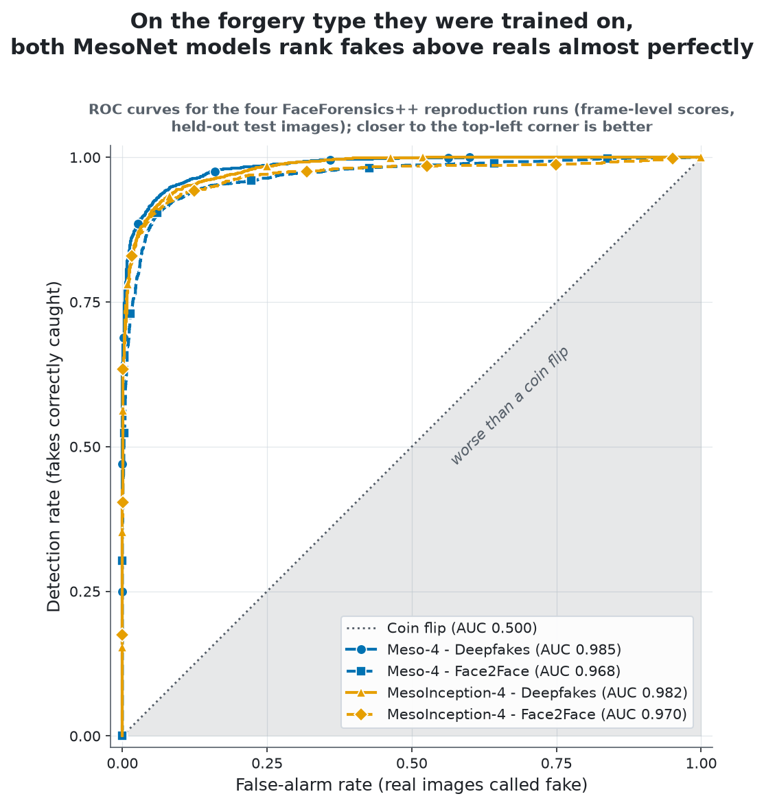
</picture>

<picture>
  <source media="(prefers-color-scheme: dark)" srcset="assets/fig_calibration.dark.png">
  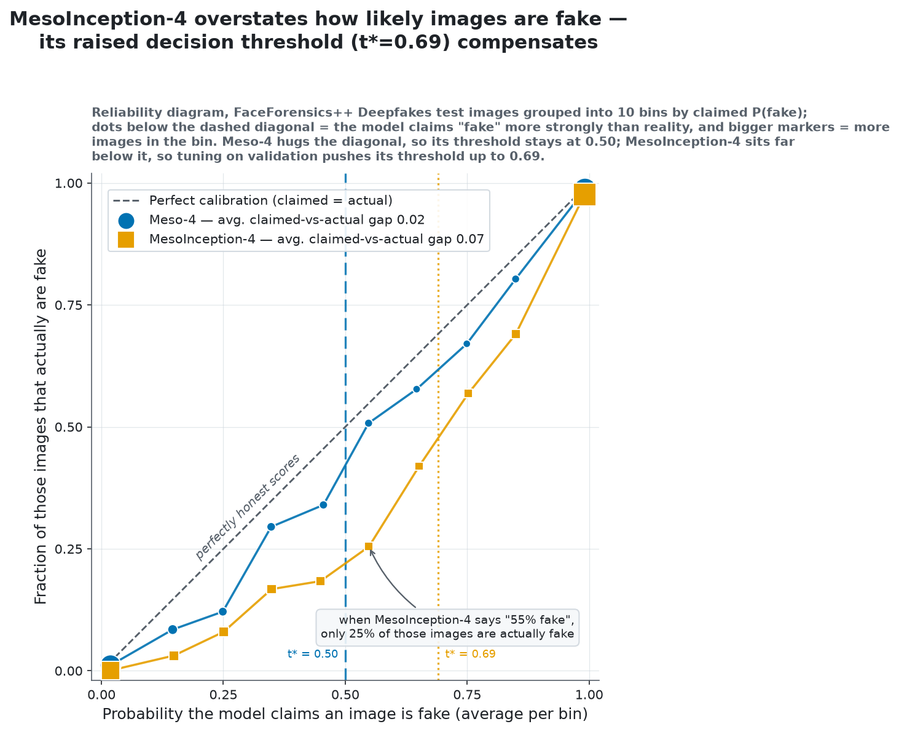
</picture>

<picture>
  <source media="(prefers-color-scheme: dark)" srcset="assets/fig_threshold_dumbbell.dark.png">
  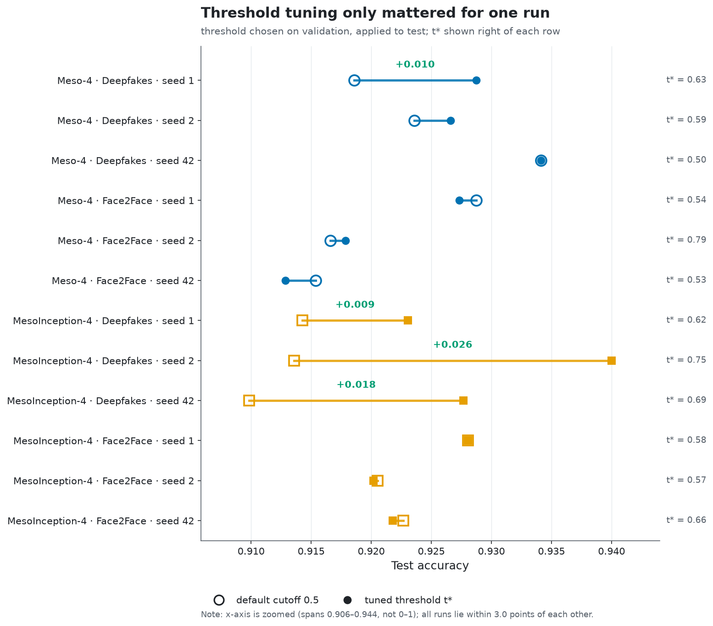
</picture>

<picture>
  <source media="(prefers-color-scheme: dark)" srcset="assets/fig_seed_spread.dark.png">
  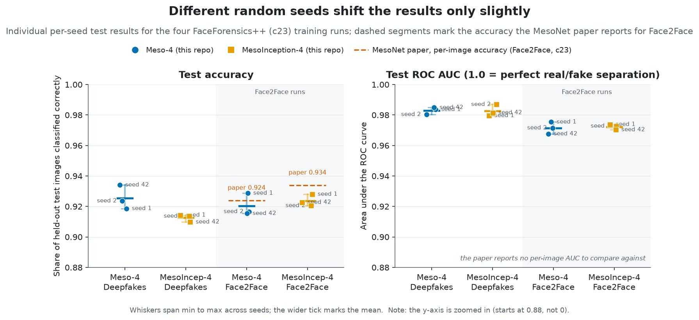
</picture>

</details>

### Generalization — one FF++-trained model, evaluated across datasets

<picture>
  <source media="(prefers-color-scheme: dark)" srcset="assets/generalization_trafficlight.dark.svg">
  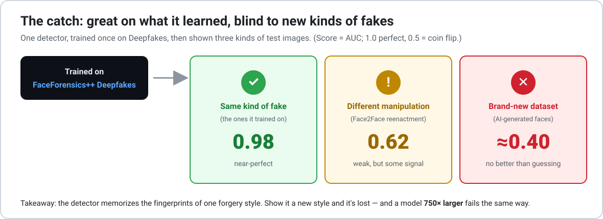
</picture>

_Not paper-comparable; the point is how performance shifts off the training distribution._
Source models: the three seeded `meso4_ff_deepfakes` checkpoints, **weights frozen**, threshold
0.5 (untuned); Meso-4 cells are mean ± std across seeds, Xception is a single seed (42). AUC is
the primary cross-dataset metric — accuracy loss can be partly threshold miscalibration, an AUC
drop is true generalization loss.

| Eval dataset | Meso-4 acc. | Meso-4 AUC | Xception acc. | Xception AUC |
|---|---|---|---|---|
| FF++ Deepfakes (in-domain reference) | 0.925 ± 0.008 | 0.983 ± 0.002 | 0.976 | 0.997 |
| FF++ Face2Face (cross-method control) | 0.546 ± 0.015 | 0.621 ± 0.011 | 0.519 | 0.718 |
| OpenForensics | 0.468 ± 0.017 | 0.408 ± 0.015 | 0.477 | 0.295 |
| 140k (StyleGAN) | 0.497 ± 0.001 | 0.408 ± 0.008 | 0.499 | 0.334 |

**Generalization findings.** Neither model transfers across datasets. Cross-*method* transfer
inside the same preprocessing domain retains usable signal (Meso-4 AUC 0.62 ± 0.01; Xception
0.72), but cross-*dataset* the signal is essentially lost: Meso-4's AUC of 0.408 ± 0.015
(OpenForensics) and 0.408 ± 0.008 (140k) is a **mild but consistent ranking inversion** — every
one of the six seed × dataset evaluations lands between 0.395 and 0.425, below chance on all
three seeds, a faint anti-correlation rather than a reliable inverted classifier — and transfer
fails in the reverse direction too (OpenForensics→FF++ sits at chance: AUC 0.46–0.50 across two
same-seed training runs). The
mechanism is consistent with low-level cue mismatch: the mesoscopic compression/resampling
artifacts learned on c23 video frames point the wrong way elsewhere — on 140k the model flags
6/10,000 fakes, plausibly because StyleGAN fakes look *smoother* to a compression-artifact
detector than FFHQ reals. Xception (`legacy_xception`, timm, ImageNet-pretrained, **20.8M params
vs MesoNet's 28k**, fine-tuned on the same root at 256×256 — global pooling makes the native-299
input a non-issue) answers the capacity question: clearly stronger in-domain (0.976/0.997) and
across methods, yet its cross-dataset inversion is *more* pronounced (AUC 0.29/0.33). The
brittleness comes from single-domain training, not model capacity. Note that a decision
threshold cannot rescue an AUC below 0.5 (the ranking itself is inverted), so the cross-dataset
numbers stand as-is — threshold tuning (T20) applies only in-domain.

<picture>
  <source media="(prefers-color-scheme: dark)" srcset="assets/fig_transfer_matrix.dark.png">
  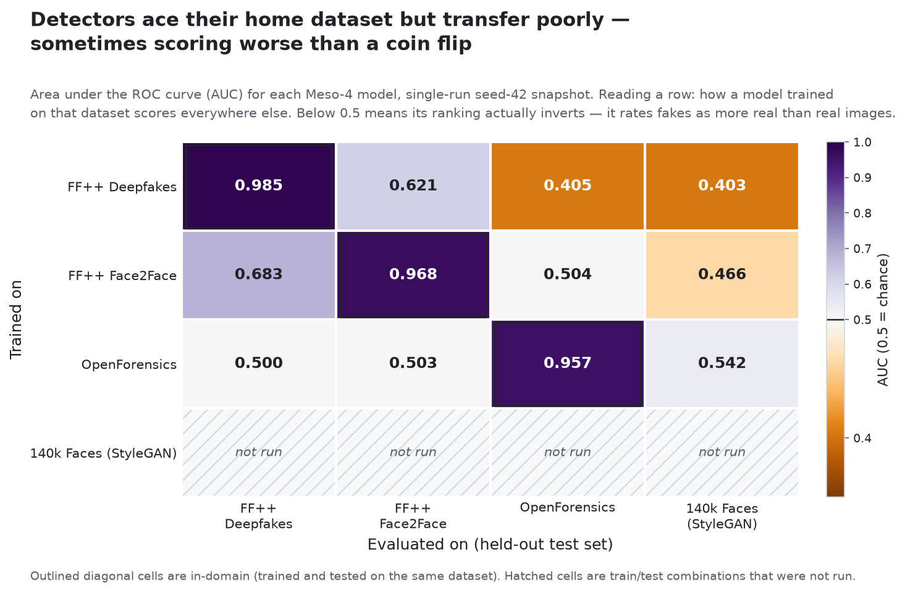
</picture>

<picture>
  <source media="(prefers-color-scheme: dark)" srcset="assets/fig_score_dist.dark.png">
  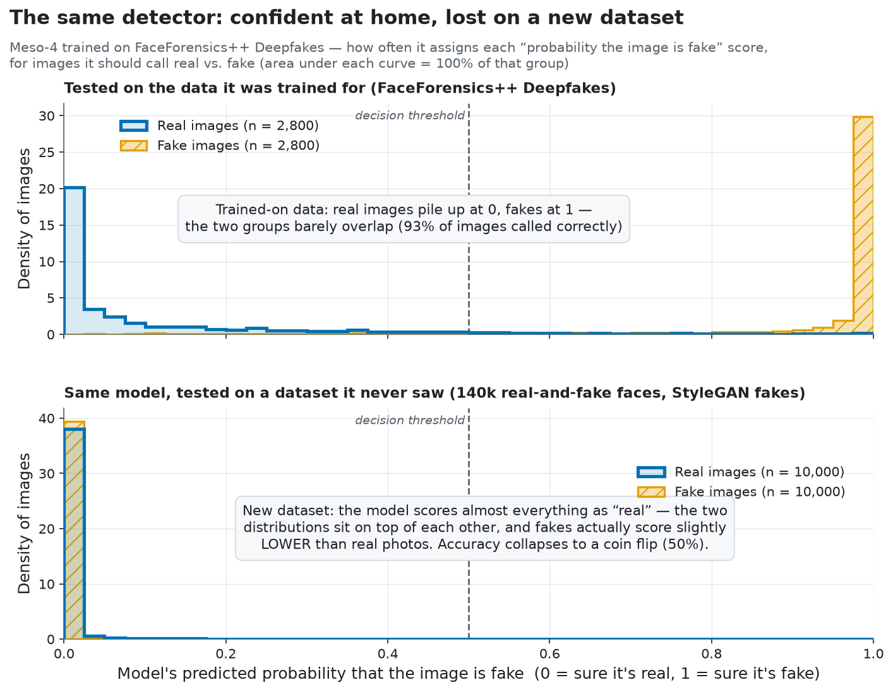
</picture>

<details>
<summary><b>More generalization views</b> — capacity scatter, confusion matrices</summary>

<picture>
  <source media="(prefers-color-scheme: dark)" srcset="assets/fig_capacity_scatter.dark.png">
  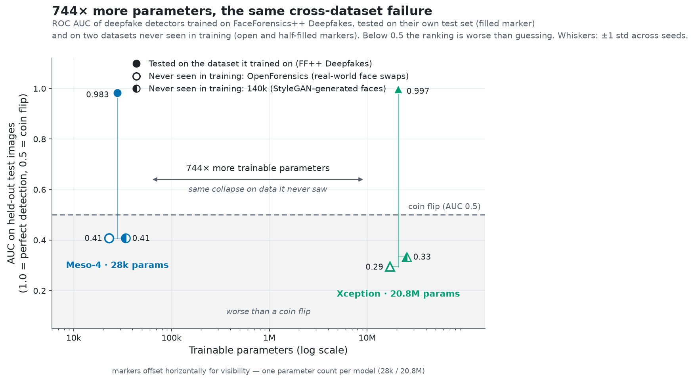
</picture>

<picture>
  <source media="(prefers-color-scheme: dark)" srcset="assets/fig_confusion.dark.png">
  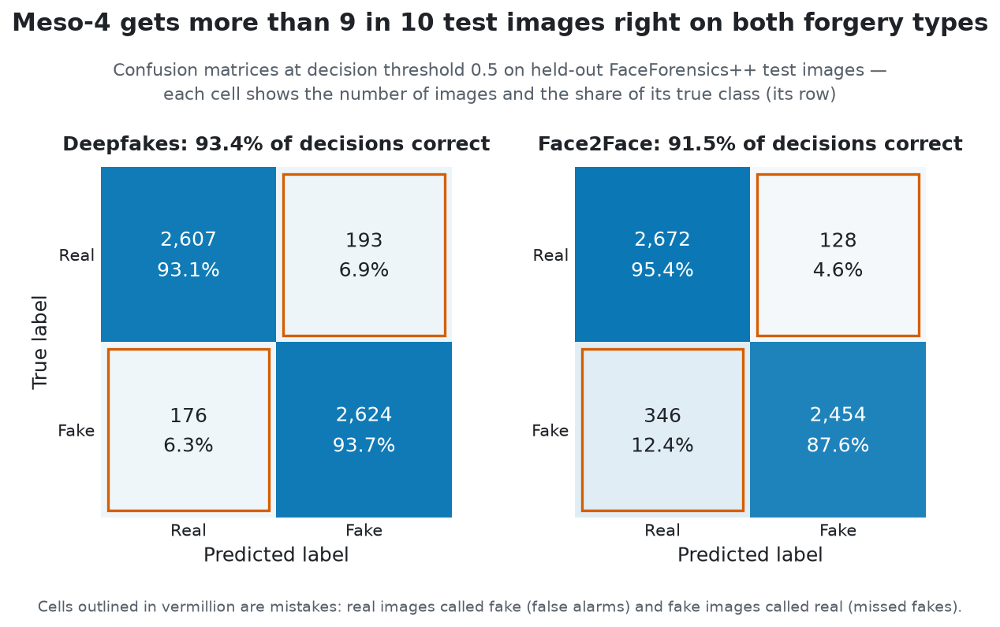
</picture>

</details>

## Limitations / future work
- **Three seeds** (42, 1, 2) for the FF++ reproduction and Meso-4 generalization numbers;
  Xception and the OpenForensics baseline remain single-seed. The spread is small (±0.2–0.9 pts
  accuracy, ±0.002–0.015 AUC) and changes no conclusion; the one question seeds settled is that
  Meso-4's Deepfakes edge over MesoInception-4 at threshold 0.5 is a **calibration** difference
  (identical AUCs; tuned accuracies converge).
- **Loss deviation:** the paper trains squared error on a sigmoid; we use `BCEWithLogitsLoss`
  (see [`docs/paper_diff.md`](docs/paper_diff.md) for this and every other difference, incl. the
  paper's step lr schedule and hue augmentation that we omit).

## Repo layout
```
configs/default.yaml      all hyperparameters (nothing hardcoded)
src/models/               Meso4, MesoInception4 (+ timm Xception baseline)
src/data/                 dataset + transforms
src/utils/                device (MPS-first), seed, config, metrics, plots
src/train.py  src/eval.py entry points
scripts/                  data download notes, FF++ extraction, threshold tuning,
                          figure suite (figstyle, make_figures, build_summary)
results/summary.json      every reported number, distilled (committed; figures build from it)
assets/                   figures + diagrams (light/dark pairs)   docs/  dashboard, paper_diff
tests/                    model + data + figure-infra tests
TASKS.md                  build checklist
```

## License
MIT — see [LICENSE](LICENSE). MIT covers this repo's code; datasets keep their own terms, and
no dataset imagery is redistributed here.

## Credits
Method: Afchar et al., WIFS 2018 ([arXiv:1809.00888](https://arxiv.org/abs/1809.00888)),
original code [DariusAf/MesoNet](https://github.com/DariusAf/MesoNet). This is an independent
educational reproduction.
